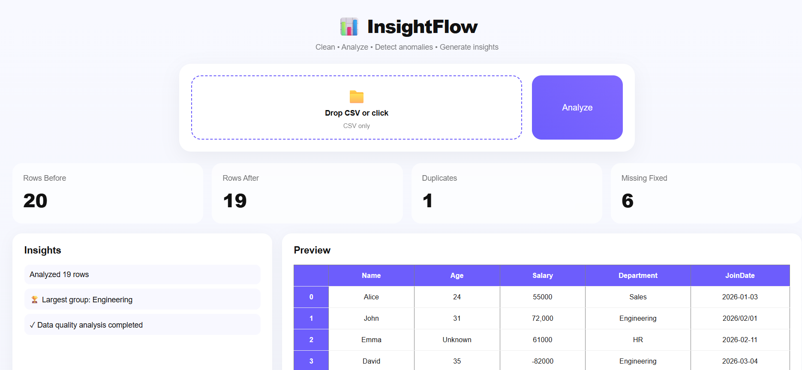

# InsightFlow

> A small tool that takes a messy CSV and tells you what's in it.

**Live demo:** https://insightflow-t50k.onrender.com/

I built InsightFlow because I was tired of opening spreadsheets in Excel,
running the same five sanity checks (any duplicates? missing values?
weird outliers? negative numbers where there shouldn't be any?), then
forgetting half of them by the time I needed the answer again. So I
wrote it down as code, and then wrapped that code in two interfaces.

## What it does

Point it at a CSV. It will:

- drop duplicate rows
- fill missing values
- describe the numeric columns (mean, range, outliers)
- flag anything suspicious (negative salaries, lone extreme values)
- give you back a one-page PDF summary, or a web dashboard, depending on
  which interface you use

The goal isn't to replace a real data analyst. It's to do the first 80%
of the cleanup automatically so you can spend your time on the
interesting questions.

## Two ways to run it

**Web app** (for when you'd rather drag-and-drop a file):

```bash
pip install -r requirements.txt
python app.py
```

Then open `http://127.0.0.1:5000`. Upload a CSV, get a dashboard with
metric cards, an insights panel, and a preview of the cleaned data.

**Command line** (for power users / scripting / when you don't want a
browser open):

```bash
python csv_data_analyzer.py --file input/data.csv
python csv_data_analyzer.py --file input/sales.csv --column revenue
python csv_data_analyzer.py --file data.csv --no-pdf       # skip PDF
```

The CLI writes three files into `output/`:
- `cleaned_data.csv` — the de-duplicated input
- `column_plot.png` — a histogram or bar chart of the analyzed column
- `analysis_report.pdf` — a one-page summary you can email to someone

## Screenshot



## How the code is organised

```
InsightFlow/
├── app.py                  Flask entry point
├── cleaner.py              dedupe + fill missing values
├── insights.py             generates the plain-English observations
├── reporter.py             writes the PDF
├── dashboard_generator.py  writes a standalone HTML dashboard
├── csv_data_analyzer.py    the all-in-one CLI version
├── templates/index.html    web app HTML
├── static/style.css        web app styles
├── input/                  sample CSV to try
└── output/                 generated files land here
```

The CLI version (`csv_data_analyzer.py`) is the original implementation
in a single file. Everything else is a refactor: I split the work into
small modules so the Flask app could reuse them without dragging in the
CLI-specific code (argparse, rich, matplotlib).

## What I learned

The first version dumped a wall of numbers in the terminal. The second
version tried to "summarize" but said nothing real. The third — the one
I shipped — picks a few specific things worth pointing out and leaves
the rest in the data. That's a small distinction but it changed how the
tool feels to use.

Going from one script to four modules also taught me how much easier
code is to change once each piece does one job. The CLI and the web app
share the same `cleaner.py` and `insights.py`. If I improve the
insights, both interfaces improve at once.

## Roadmap

Things I'd like to add when I get the time:
- charts inside the web dashboard, not just the CLI
- an "export dashboard" button
- historical uploads (so you can compare today's CSV to last week's)
- a dark mode for the web UI

## License

MIT — see [LICENSE](LICENSE). Code is free to borrow.

---

Built by [Nabintou S. Fofana](https://github.com/NabintouSFofana).
